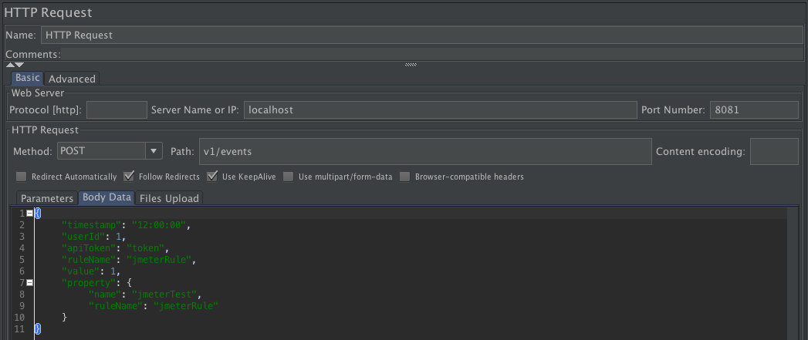

#JMeter tests

###First test: 

A user is sending the same event 1000 times at the same moment: 

Request sent to the server (the rule is triggered if value == 1):

Response of the server:

Results of the JMeter test:

We ran this test multiples times and the only errors we got were connections resets by the server, so not a big deal:

We also tried this test with a second POST request being sent at the same time and posting an event on the same rule but with a different user. The results were sensibly the same so we only put here the 2 results summaries:

User1:

User2

It allowed us to verify how our server handles concurency, because we could look at the database and check how many badges each user had. To do this, we made two postman GET requests on /users/user1 and /users/user2 and counted the number of lines of each response. They were identical. Boum.

Our server seemed to handle a relatively heavy load without any big problems or slow-downs. We had a few WRITE ERRORS sometimes but we couldn't isolate them or reproduce efficacely the conditions. We also encountered no server crash during our tests.

