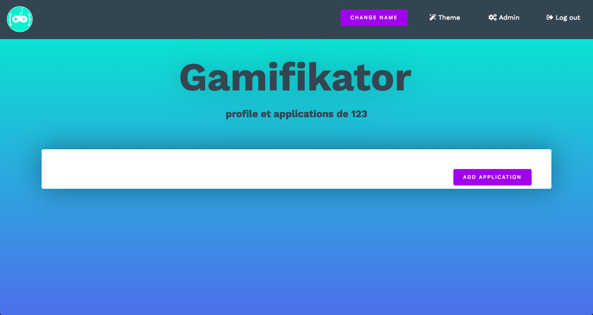
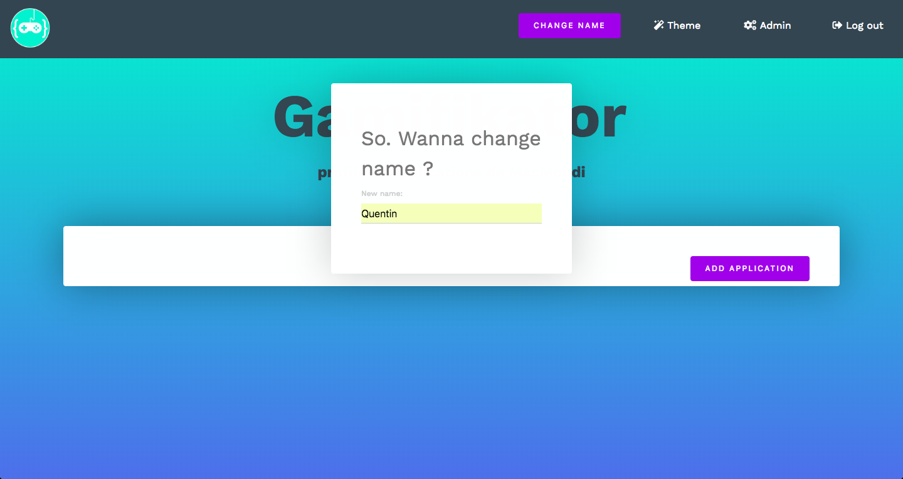

# Test scenario des transactions

## Implementation

Nous utilisé des transations à 2 endroits dans notre code (les DAO) avec l'annotation suivante 
	
	UserDAO et ApplicationDAO
	

## Test

Afin de tester le bon fonctionnement de nos transactions, nous allons provoquer une erreur dans le processus de changement de pseudonyme.

Dans UserDAO, une exception est thrown quand a mis à jour un User :

	@Override
		public void update(User user) throws Exception {
			if (findByEmail(user.getEmail()) != null) {
				em.merge(user);
			}
			throw new Exception("Huge error");
		}
		
On appelle update() dans HomeServlet (userDAO est un EJB):

	@Override
	protected void doPost(HttpServletRequest req, HttpServletResponse resp) throws ServletException, IOException {

		User currentUser = (User) req.getSession().getAttribute("user");
		currentUser.setUsername(req.getParameter("newName"));
		try {
			userDAO.update(currentUser);

		} catch (Exception e) {
			e.printStackTrace();
		}
		req.getRequestDispatcher(HOME_JSP).forward(req,resp);

	}
	
Cette methode POST est appelée quand l'utilisateur courant a changé son pseudonyme.

On a donc provoqué une erreur après l'inscription dans la base de donnée de notre nouveau pseudonyme. La transaction devrait donc être rollback et la base de donnée intouchée. 

## Procédure de test

1. On se login et on va sur la page home (/home).
2. On peut voir notre nom actuel 
	
3. Modification effectuée
	
4. On revient sur home et la valeur n'a pas été modifiée. Le rollback fonctionne donc (le nouveau nom est temporairement affiché, un reload recharge la valeur depuis la BD).
	

	

